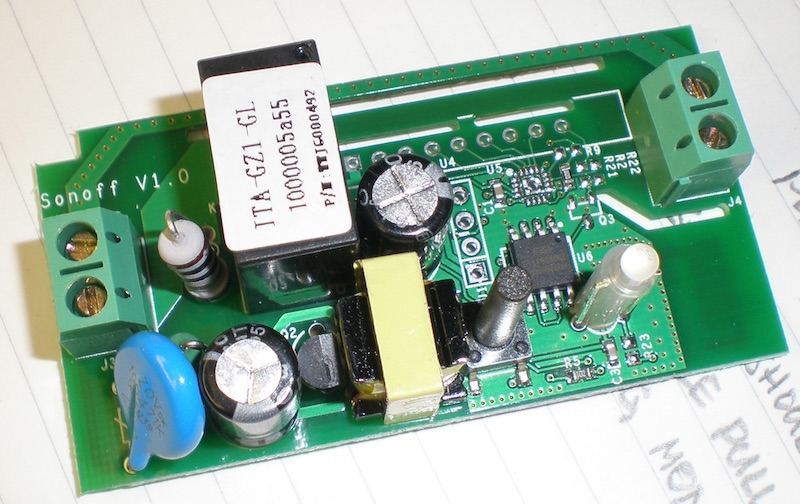
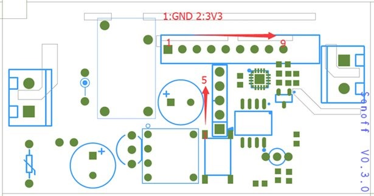
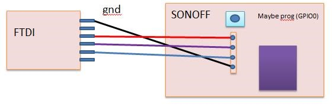
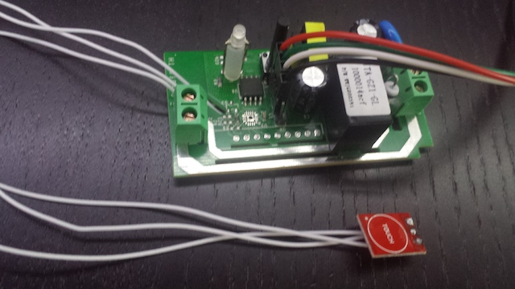

# Itead Sonoff ESP8266 NodeMCU firmware (LUA)

FTDI | Sonoff (from top to bottom)
--- | ---
3V3	| 1
TX | 2 (RX)
RX | 3 (TX)
GND | 4
 | 5

Function | GPIO | NodeMCU
--- | --- | ---
Button | 0 | 3
Relay | 12 | 6
Green LED | 13 | 7
Spare (pin 5) | 14 | 5

## Hardware
- Itead Sonoff
- TTP223 sensor module

## MQTT
Outgoing messages

- /home/iot/{Device-IP}/out/online               *- ON - connectted to MQTT, OFF - disconnected (LWT)*
- /home/iot/{Device-IP}/out/button               *- 1 - short press, 2 - long press (or double click to TTP223)*
- /home/iot/{Device-IP}/out/relay                *- ON or OFF*
- /home/iot/{Device-IP}/out/state/uptime         *- Up time in seconds*
- /home/iot/{Device-IP}/out/state/memory         *- Free memory in bytes*

Input messages
- /home/iot/{Device-IP}/in/relay                *- ON | OFF | INVERT*
- /home/iot/{Device-IP}/in/climate/temp         *No message*
- /home/iot/{Device-IP}/in/climate/humidity     *No message*
- /home/iot/{Device-IP}/in/state/uptime         *No message*
- /home/iot/{Device-IP}/in/state/memory         *No message*

## Installation
1. Install integer NodeMCU formware with modules: *dht, file, gpio, mqtt, net, node, tmr, uart, wifi* (http://nodemcu-build.com/)
2. Install nodemcu-tool:
   *npm install nodemcu-tool -g*
3. Run *./upload.sh* to upload code
